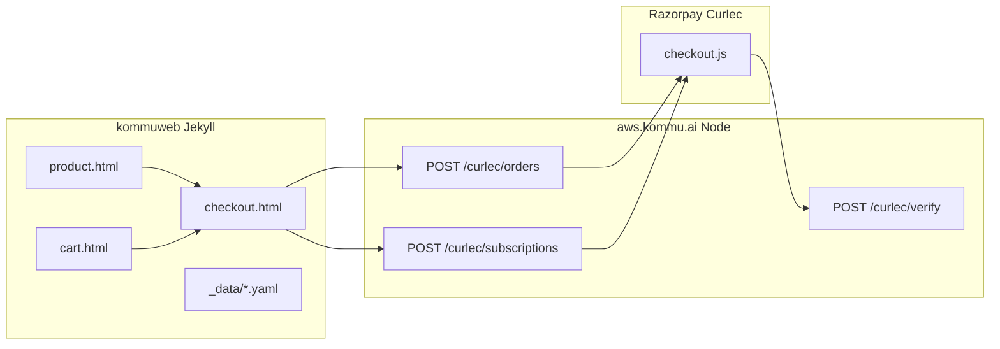

# Kommuweb architecture

## Overview

Kommuweb is a **Jekyll** static site (`kommu.ai`) for marketing, product configuration, and checkout. Payment secrets and Razorpay API calls live on **`aws.kommu.ai`** (Go Lambda `CurlecGateway` in [`cmd_aws/payment/`](../cmd_aws/payment/)).

## Layout and includes

| Path | Role |
|------|------|
| `_layouts/default.html` | Shell: head, nav, content, cart, footer |
| `_includes/currency_helpers.html` | `getCurrencyCode`, `formatPrice` (global) |
| `_includes/pricing_helpers.html` | Products, promos, rules, `KommuPricing` |
| `_includes/razorpay_checkout.html` | Standard Checkout client (`KommuCheckout`) |
| `_includes/cart.html` | `localStorage` cart drawer |

## Data-driven commerce

| File | Purpose |
|------|---------|
| `_data/products.yaml` | SKUs, prices, subscription `plan_id`, deposit, `sub_device_price` |
| `_data/promotions.yaml` | Label-based promo overrides |
| `_data/checkout_rules.yaml` | Routes checkout to `razorpay-order`, `razorpay-subscription`, or `stripe` |
| `_data/shipping.yaml` | Country shipping rates |

## International vs Malaysia

- **MYR** (locale `en-MY`): Razorpay Standard Checkout — Orders (one-off/cart) or Subscriptions (rent-to-own).
- **Non-MYR**: Stripe redirect (`/stripe/checkout`) — unchanged in this migration.

## Post-payment pages

- `trx-success.html` — one-off success; verifies `razorpay_*` query params when present.
- `trx-pending.html` — rent-to-own / subscription authorisation pending copy.
